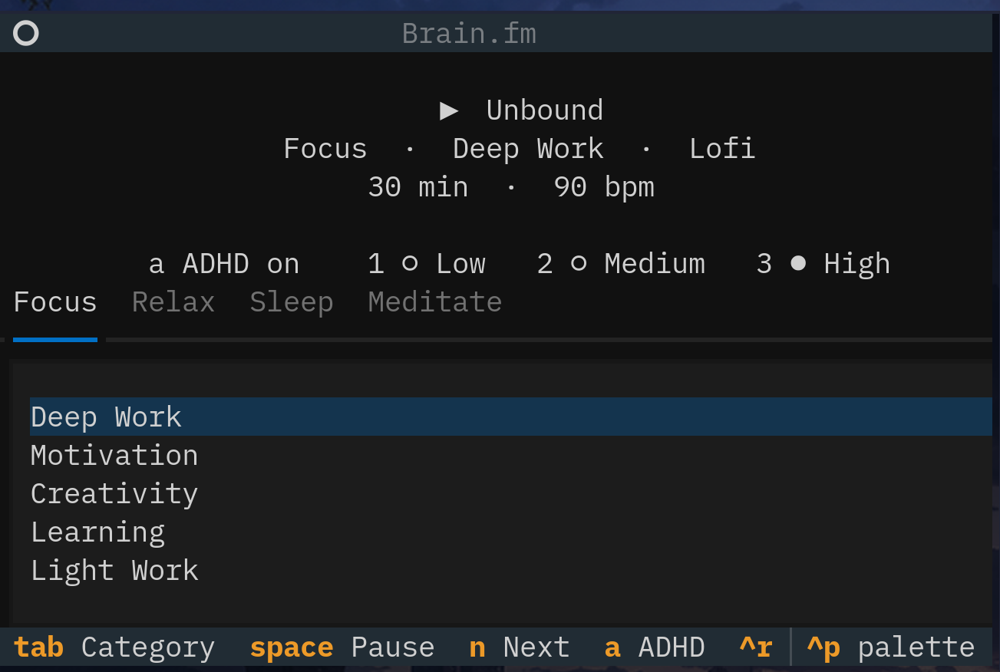

# brain-fm-tui

A terminal player for your own Brain.fm subscription. The interface is a [Python](https://www.python.org/) [Textual](https://textual.textualize.io/) app. Audio goes through [mpv](https://mpv.io/). It does not open a browser, and it does not launch the official desktop app.



This project has nothing to do with Brain.fm. It is not affiliated with, endorsed by, or maintained by them. Brain.fm is a trademark of its owner. You need your own subscription. The API is not a public one, and it can change without notice.

## Install

You need Python 3.12 or newer, and `mpv` on your `PATH`. `playerctl` is optional. It is how media keys and other players talk to this one.

With [uv](https://docs.astral.sh/uv/):

```sh
uv sync
uv run brain-fm-tui --setup
uv run brain-fm-tui
```

Or with pip, from a clone of this repository:

```sh
pip install .
brain-fm-tui --setup
brain-fm-tui
```

`uv sync` also installs the test dependency. `pip install .` installs the player only. Tests are `uv run pytest`.

## Session

The player does not log you in. You paste the session cookie yourself.

Open the site, then developer tools, Network. The initiator document is the one document request. Open it, Cookies, the last one is `token`. Copy that value.

```sh
brain-fm-tui --setup
```

The prompt is `paste your cookie here:`. Nothing is shown while you paste. That is the hide, not a stuck prompt. Press Enter after it. The token is written to `~/.local/share/brain-fm-tui/session` and is not printed back. A value that is not a token is rejected.

The cookie is short-lived, about 15 minutes. When it expires, paste a new one the same way. Ctrl+R only re-reads the file on disk. It does not sign you in, and it does not open anything.

## Keys

Tab and Shift+Tab move between Focus, Relax, Sleep, and Meditate. Enter plays the highlighted activity. Space pauses. `n` skips to the next track. `q` quits, and stops mpv.

`a` toggles ADHD for the category you are on. On Brain.fm that means the neural effect is High and nothing else. `1`, `2`, and `3` toggle Low, Medium, and High on their own, so more than one can be on. A filled dot is selected. The choice is saved to the same preference the website uses, and it follows the category tab. If that category is already playing, the session starts again with the new mix.

Ctrl+P opens Textual's command palette.

## playerctl

This player publishes an MPRIS service, so `playerctl` play, pause, next, and volume talk to it. Next asks Brain.fm for the next queued track. It does not restart the one that is playing. If something else already owns the name `brainfm`, the footer shows the name that was used instead.

## License

Apache-2.0. See `LICENSE`.
